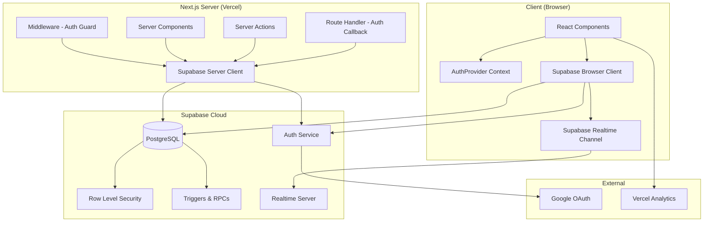
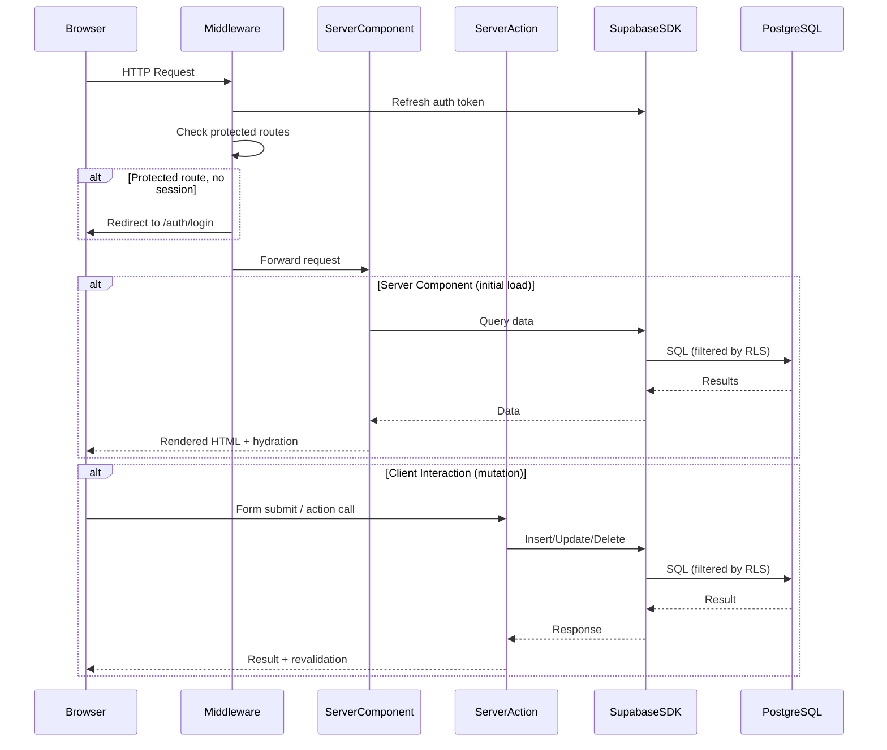
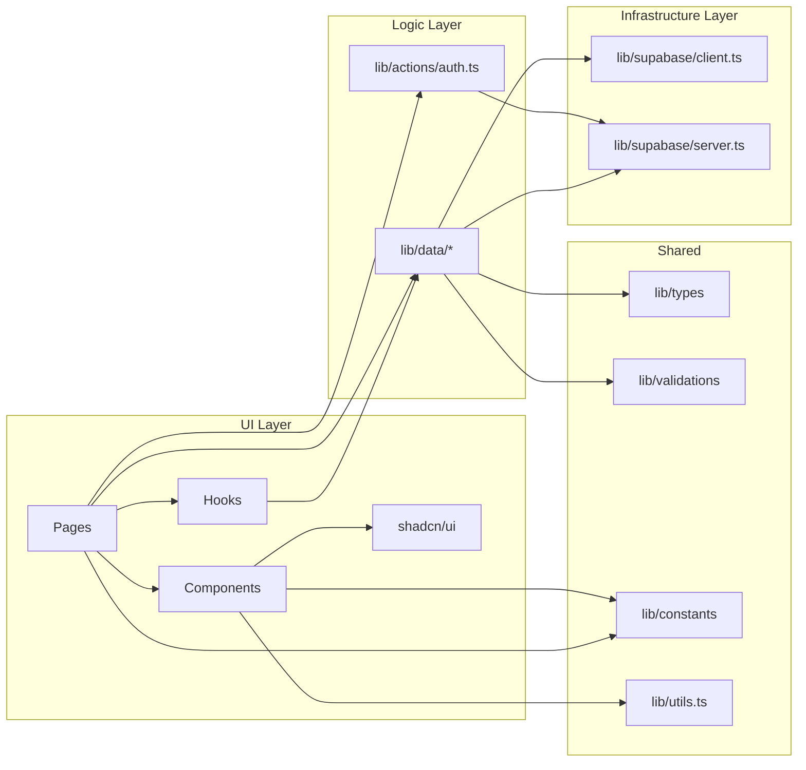
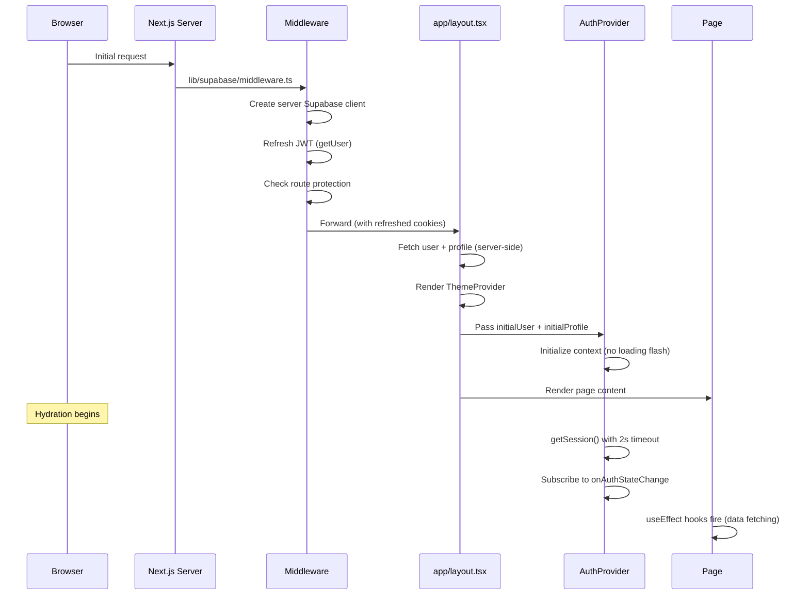
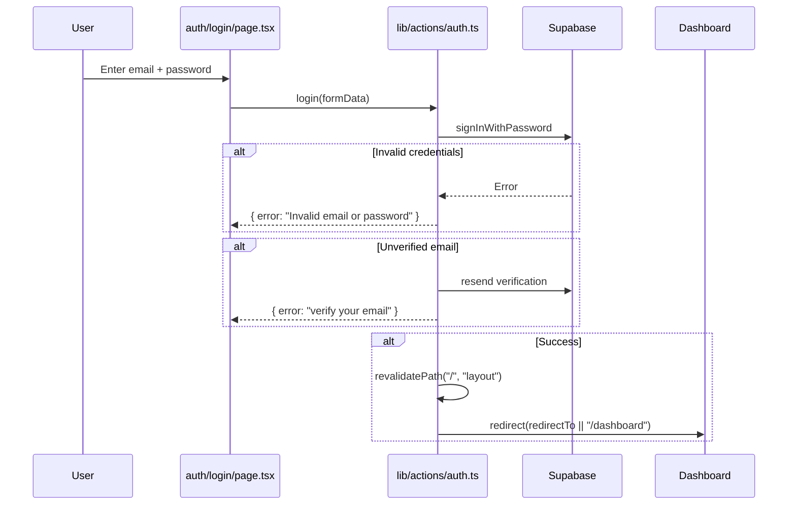
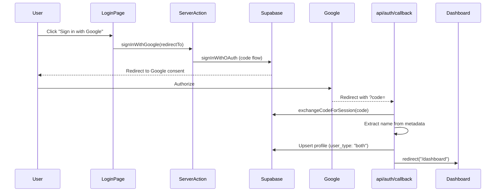
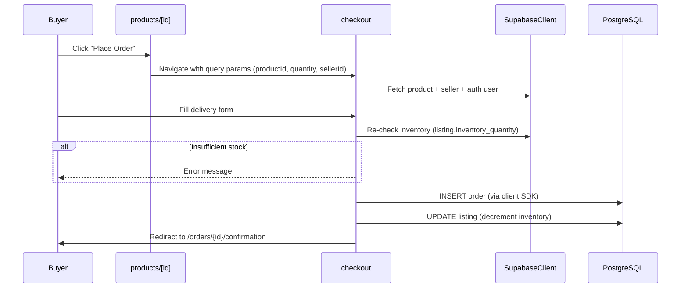
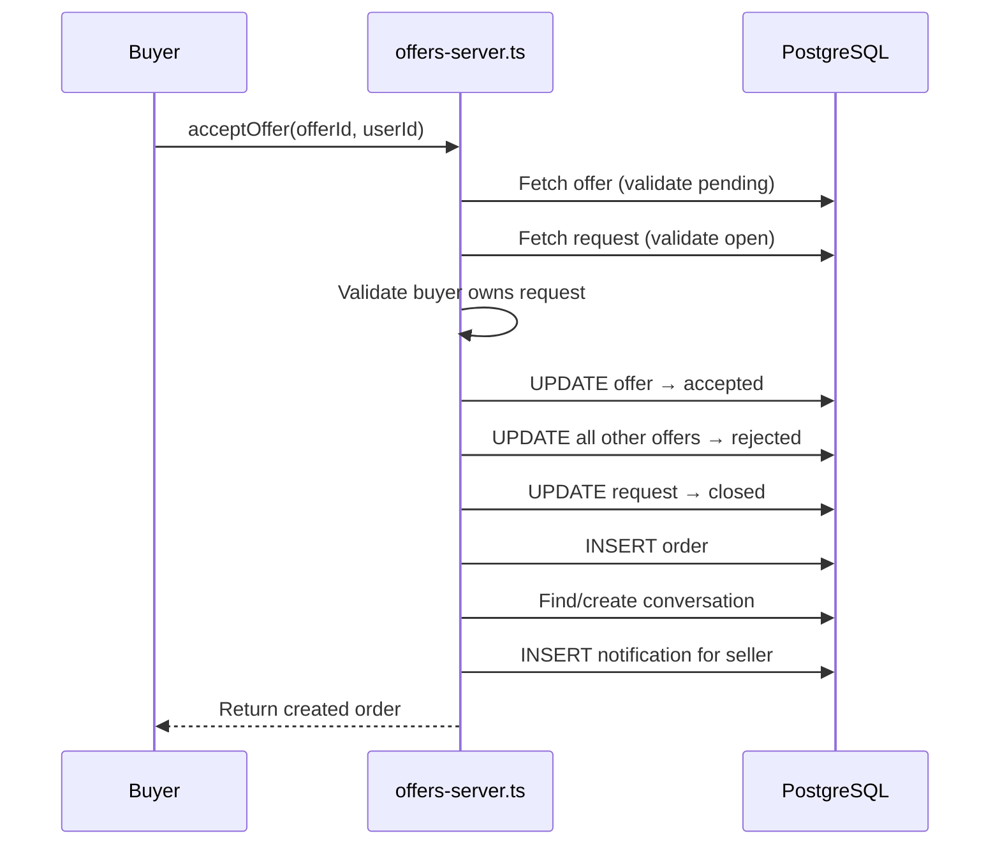
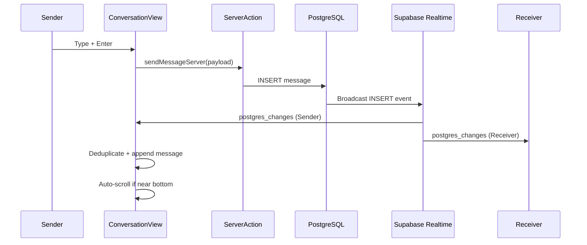
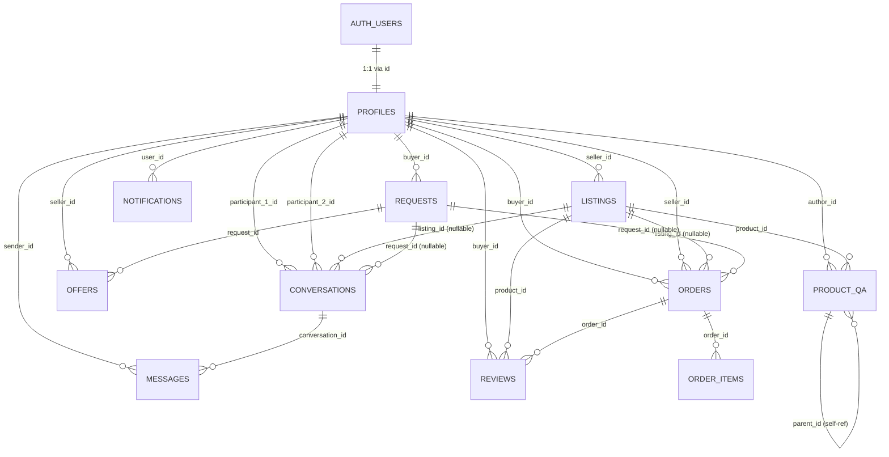

# RevCom - Complete Technical Documentation

> **Ethiopia's Premier B2B/B2C Marketplace**
> Last updated: 2026-02-23 | Branch: `workflow_up`

---

## Table of Contents

1. [Project Overview](#1-project-overview)
2. [System Architecture](#2-system-architecture)
3. [Repository Structure](#3-repository-structure)
4. [Module Documentation](#4-module-documentation)
5. [File-Level Documentation](#5-file-level-documentation)
6. [Function & Class Documentation](#6-function--class-documentation)
7. [Execution Flow](#7-execution-flow)
8. [Data Models](#8-data-models)
9. [Configuration & Environment](#9-configuration--environment)
10. [External Dependencies](#10-external-dependencies)
11. [Build & Deployment](#11-build--deployment)
12. [Extension Guide](#12-extension-guide)
13. [Known Risks & Technical Debt](#13-known-risks--technical-debt)
14. [AI Agent Context](#14-ai_agent_context)
15. [Glossary](#15-glossary)

---

## 1. Project Overview

### Purpose

RevCom is a dual-role online marketplace connecting buyers and sellers in Ethiopia. Buyers post procurement requests (what they need), and sellers respond with offers or list products directly. The platform facilitates the entire lifecycle: discovery, negotiation, ordering, delivery tracking, reviews, and Q&A.

### Problems It Solves

- **Buyer-seller discovery**: Buyers describe needs; sellers find relevant opportunities
- **Offer/bid management**: Structured offer workflow with accept/reject/withdraw states
- **Real-time communication**: Integrated messaging tied to listings and requests
- **Order lifecycle**: Status tracking from pending through delivery
- **Trust & reputation**: Product reviews, seller ratings, verified purchases, Q&A

### High-Level Architecture Summary

- **Framework**: Next.js 16.1.6 (App Router) with TypeScript
- **Database**: Supabase (hosted PostgreSQL with auth, RLS, realtime)
- **UI**: Tailwind CSS 4 + shadcn/ui (Radix UI primitives)
- **Auth**: Supabase Auth (email/password + Google OAuth)
- **State**: React Context (AuthProvider) + local component state
- **Deployment**: Vercel (revecom.vercel.app)
- **Package Manager**: pnpm

### Core Concepts

| Concept | Description |
|---------|-------------|
| **Listing/Product** | A seller-posted item available for purchase |
| **Request** | A buyer-posted procurement need with budget range |
| **Offer** | A seller's bid on a buyer request (price, timeline, terms) |
| **Order** | A confirmed transaction between buyer and seller |
| **Conversation** | A messaging thread between two users, optionally tied to a listing or request |
| **Review** | A buyer's rating of a product, tied to a completed order |
| **Product Q&A** | Threaded questions and seller answers on product pages |

### Key Design Philosophy

- **Dual-role users**: A single account can act as both buyer and seller (`user_type: "both"`)
- **Server-first data fetching**: Server components and server actions for initial data; client components for interactivity
- **Supabase as backend**: No custom API layer. All data access goes through Supabase JS SDK, secured by Row Level Security (RLS) policies
- **Component-per-feature**: Business logic is colocated in page files rather than extracted into shared services

---

## 2. System Architecture

### Architectural Style

**Monolithic Next.js application** with a clear layered architecture:

1. **Presentation Layer**: React components (app/, components/)
2. **Data Access Layer**: Supabase query functions (lib/data/)
3. **Database Layer**: Supabase PostgreSQL with RLS, triggers, and RPCs

There is no dedicated API layer; the single API route (`/api/auth/callback`) handles only OAuth callbacks. All other data operations use Supabase's client SDK directly or via Next.js server actions.

### Architecture Diagram



### Major Components

| Component | Location | Responsibility |
|-----------|----------|---------------|
| **Pages** | `app/` | Route handling, server-side data fetching, page-level UI |
| **Components** | `components/` | Reusable UI elements, layout, feature components |
| **Data Layer** | `lib/data/` | All Supabase queries (CRUD + workflows) |
| **Hooks** | `lib/hooks/` | Client-side data fetching wrappers with loading/error state |
| **Auth** | `lib/actions/auth.ts`, `lib/supabase/`, `components/providers/` | Authentication flows, session management |
| **Types** | `lib/types/` | TypeScript interfaces for all domain entities |
| **Validation** | `lib/validations/` | Zod schemas for form validation |
| **Constants** | `lib/constants/` | Enums, route definitions, category lists |

### Data Flow



### Dependency Relationships



---

## 3. Repository Structure

```
revcom/
├── app/                          # Next.js App Router (all routes)
│   ├── layout.tsx                # Root layout: providers, navbar, footer
│   ├── page.tsx                  # Home/landing page
│   ├── globals.css               # Design system (CSS custom properties + Tailwind theme)
│   ├── api/
│   │   └── auth/callback/
│   │       └── route.ts          # OAuth/email verification callback
│   ├── auth/                     # Public auth pages
│   │   ├── login/
│   │   ├── sign-up/
│   │   └── sign-up-success/
│   ├── buyer/                    # Buyer-specific protected pages
│   │   ├── listings/             # Manage buyer's own listings
│   │   ├── orders/               # View buyer's orders
│   │   ├── requests/             # Create/manage procurement requests
│   │   └── reviews/              # Buyer's reviews
│   ├── seller/                   # Seller-specific protected pages
│   │   ├── products/             # Manage product catalog
│   │   ├── orders/               # Manage seller's orders
│   │   ├── offers/               # View offers sent
│   │   └── explore/              # Browse buyer requests
│   ├── products/                 # Public product browsing
│   │   └── [id]/                 # Product detail page              
│   ├── requests/                 # Public requests browsing
│   │   └── [id]                  # Request detail page
|   |    └──/make-offer/          # Seller makes an offer on a request
│   ├── orders/
│   │   └── [id]/confirmation/    # Order confirmation page
│   ├── messages/                 # Real-time messaging
│   │   ├── [id]/                 # Specific conversation
│   │   └── MessagesClient.tsx    # Client-side messaging UI
│   ├── dashboard/                # Role-based dashboard
│   ├── profile/                  # User profile management
│   ├── checkout/                 # Order placement flow
│   └── notifications/            # Notification feed
│
├── components/                   # Reusable React components
│   ├── ui/                       # shadcn/ui primitives (button, dialog, input, etc.)
│   ├── layout/                   # Navbar, Footer, Container
│   ├── features/                 # Domain components (ProductCard, RequestCard, SearchBar)
│   ├── providers/                # AuthProvider (React Context)
│   ├── reviews/                  # Review system (ReviewModal, ReviewCard, StarRating, etc.)
│   ├── comments/                 # Product Q&A (QuestionCard, QuestionForm, etc.)
│   ├── skeletons/                # Loading skeletons for messaging
│   ├── dashboard/                # RoleSwitcher (likely unused)
│   ├── ConversationView.tsx      # Real-time chat UI
│   ├── hero.tsx                  # Landing page hero
│   ├── features.tsx              # Landing page feature grid
│   ├── theme-provider.tsx        # next-themes wrapper
│   ├── theme-toggle.tsx          # Dark/light mode toggle
│   ├── dashboard-nav.tsx         # Alternate nav (likely unused)
│   ├── listing-card.tsx          # Listing card variant
│   ├── accept-offer-modal.tsx    # Accept offer confirmation dialog
│   ├── reject-offer-modal.tsx    # Reject offer confirmation dialog
│   ├── offer-actions.tsx         # Offer action buttons
│   ├── buyer-listing-edit-form.tsx  # Buyer listing edit form
│   └── card-skeleton.tsx         # Generic card loading skeleton
│
├── lib/                          # Core application logic
│   ├── data/                     # Data access layer (Supabase queries)
│   │   ├── index.ts              # Barrel re-export of client modules
│   │   ├── reviews.ts            # Review CRUD + RPCs
│   │   ├── comments.ts           # Product Q&A operations
│   │   ├── profiles.ts           # Profile read/update (client)
│   │   ├── profiles-server.ts    # Profile read/update (server)
│   │   ├── orders.ts             # Order CRUD + notifications (client)
│   │   ├── orders-server.ts      # Order CRUD + notifications (server)
│   │   ├── offers.ts             # Offer CRUD (client)
│   │   ├── offers-server.ts      # Offer CRUD + accept/reject workflows (server)
│   │   ├── listings.ts           # Listing CRUD + filtering (client)
│   │   ├── listings-server.ts    # Listing CRUD + filtering (server)
│   │   ├── requests.ts           # Request CRUD (client)
│   │   ├── requests-server.ts    # Request CRUD (server)
│   │   ├── conversations.ts      # Messaging operations (client, dual API)
│   │   ├── conversations-server.ts # Messaging operations (server)
│   │   ├── notifications-server.ts # Notification CRUD (server only)
│   │   └── dashboard.ts          # Dashboard aggregate queries
│   ├── hooks/                    # Custom React hooks
│   │   ├── useAuth.ts            # Standalone auth hook (alternative to provider)
│   │   ├── useProducts.ts        # Product list/detail fetching
│   │   ├── useRequests.ts        # Request list/detail fetching
│   │   ├── use-notification-count.ts # Polling notification badge
│   │   └── use-toast.ts          # Toast notification system (shadcn)
│   ├── supabase/                 # Supabase client configuration
│   │   ├── client.ts             # Browser client (createBrowserClient)
│   │   ├── server.ts             # Server client (createServerClient)
│   │   └── middleware.ts         # Auth middleware (token refresh + route guards)
│   ├── actions/
│   │   └── auth.ts               # Server actions: login, signup, signOut, Google OAuth
│   ├── types/
│   │   └── index.ts              # All TypeScript interfaces
│   ├── validations/
│   │   └── schemas.ts            # Zod validation schemas
│   ├── constants/
│   │   ├── categories.ts         # Enums: categories, statuses, user types, price ranges
│   │   └── routes.ts             # Type-safe route map
│   └── utils.ts                  # cn() utility (clsx + tailwind-merge)
│
├── styles/
│   ├── globals.css               # (Alternate location, may be unused)
│   └── design-tokens.css         # Vestigial design tokens (warm/beige palette, unused)
│
├── supabase/
│   └── migrations/               # SQL migration files (001–014)
│       ├── 001_create_tables.sql
│       ├── ...
│       └── 014_create_comments_table.sql
│
├── public/                       # Static assets
│   ├── placeholder-*.{jpg,png,svg}
│   ├── robots.txt
│   └── sitemap.txt
│
├── package.json
├── pnpm-lock.yaml
├── tsconfig.json
├── next.config.mjs               # Empty (defaults)
├── postcss.config.mjs
├── eslint.config.mjs
├── .env.example
└── .gitignore
```

---

## 4. Module Documentation

### 4.1 Authentication Module

**Location**: `lib/actions/auth.ts`, `lib/supabase/`, `components/providers/AuthProvider.tsx`, `app/api/auth/callback/`

**Responsibility**: User registration, login (email + Google), session management, profile creation, route protection.

**Public Interfaces**:
- `login(formData: FormData)` — Server action for email/password login
- `signup(formData: FormData)` — Server action for registration
- `signOut()` — Server action for logout
- `signInWithGoogle(redirectTo?: string)` — Server action for OAuth
- `useAuth()` — Context hook returning `{ user, profile, session, loading, isReady, signOut, isAuthenticated, isBuyer, isSeller, refreshProfile }`

**Internal Logic**:
1. Middleware intercepts every request, refreshes JWT via `supabase.auth.getUser()`
2. Protected route prefixes (`/buyer`, `/seller`, `/dashboard`, `/messages`, `/notifications`, `/profile`, `/checkout`) redirect to login if no session
3. Authenticated users on `/auth/*` are redirected to `/dashboard`
4. Login handles unverified emails by auto-resending verification
5. Signup creates a profile row immediately after user creation
6. OAuth callback (`/api/auth/callback`) exchanges code for session, upserts profile with name extraction from provider metadata

**Dependencies**: `@supabase/ssr`, `@supabase/supabase-js`, `next/headers`, `next/navigation`

**Side Effects**: Cookie manipulation (JWT tokens), database writes (profile upsert), email sending (verification)

**Known Constraints**:
- OAuth users are hardcoded as `user_type: "both"`
- Profile creation happens in two places (signup action + callback route) with different conflict strategies (insert vs upsert)
- Two conflicting `useAuth` exports exist (context-based in AuthProvider, standalone in hooks)

### 4.2 Data Access Module

**Location**: `lib/data/`

**Responsibility**: All Supabase database queries. Organized by domain entity with client/server variants.

**Pattern**: Each entity has:
- `entity.ts` — Client-side functions using `createClient()` (synchronous, browser)
- `entity-server.ts` — Server-side functions marked with `"use server"`, using `await createClient()` (async, cookie-based)

**Public Interfaces**: See [Section 6](#6-function--class-documentation) for complete function signatures.

**Dependencies**: `lib/supabase/client.ts`, `lib/supabase/server.ts`

**Side Effects**: Database reads, inserts, updates, deletes, notification creation

**Known Constraints**:
- Error handling is inconsistent (some throw, some return null/empty, some console.error)
- `acceptOffer` performs 9 sequential mutations without a database transaction
- Client and server versions of the same function sometimes diverge in fields and behavior
- `conversations.ts` has legacy functions accepting `supabase: any` as first parameter

### 4.3 UI Component Module

**Location**: `components/`

**Responsibility**: Reusable React components organized by domain.

**Sub-modules**:

| Directory | Purpose | Component Count |
|-----------|---------|----------------|
| `ui/` | shadcn/ui primitives (Button, Dialog, Input, etc.) | 18 |
| `features/` | Domain cards and controls (ProductCard, RequestCard, SearchBar, CategoryNav) | 6 |
| `layout/` | Structural components (Navbar, Footer, Container) | 3 |
| `reviews/` | Review system (ReviewModal, ReviewCard, StarRating, RatingBreakdown, etc.) | 7 |
| `comments/` | Product Q&A (QuestionCard, QuestionForm, ProductQA, SellerQATab) | 4 |
| `providers/` | AuthProvider context | 1 |
| `skeletons/` | Loading states for messaging | 2 |

### 4.4 Hooks Module

**Location**: `lib/hooks/`

**Responsibility**: Client-side data fetching with loading/error state management.

| Hook | Purpose | Data Source | Refresh Strategy |
|------|---------|-------------|-----------------|
| `useProducts(filters?)` | Fetch product listings | `getListings` server action | On filter change |
| `useProduct(id)` | Fetch single product | `getListingById` server action | On id change |
| `useRequests(filters?)` | Fetch buyer requests | `getOpenRequests`/`getBuyerRequests` server action | On filter change |
| `useRequest(id)` | Fetch single request | `getRequestById` server action | On id change |
| `use-notification-count(userId)` | Unread notification count | `getUnreadNotificationCount` server action | 30s polling |
| `use-toast()` | Toast notifications | Module-level singleton store | Event-driven |

### 4.5 Validation Module

**Location**: `lib/validations/schemas.ts`

**Responsibility**: Runtime form validation using Zod schemas.

| Schema | Used By | Key Rules |
|--------|---------|-----------|
| `requestSchema` | Buyer request forms | Title 5-200 chars, desc 20-2000 chars, budget_max >= budget_min |
| `productSchema` | Seller product forms | Price > 0, inventory >= 0, valid URL for images |
| `profileSchema` | Profile edit page | Names 1-50 chars, bio max 500 |
| `messageSchema` | Chat input | Content 1-1000 chars |
| `orderSchema` | Order creation | Title min 5, desc min 10, quantity > 0, price > 0 |
| `reviewSchema` | Review modal | Rating 1-5 integer, comment max 1000 |
| `questionSchema` | Q&A form | Content 5-500 chars |
| `searchFilterSchema` | Search/filter UI | Optional fields, valid enum values |

### 4.6 Constants Module

**Location**: `lib/constants/`

**Responsibility**: Application-wide enums and route definitions.

**Files**:
- `categories.ts` — All enum tuples (`CATEGORIES`, `ORDER_STATUSES`, `REQUEST_STATUSES`, `PRODUCT_STATUSES`, `USER_TYPES`, `PRICE_RANGES`, `SORT_OPTIONS`) with derived TypeScript types
- `routes.ts` — Type-safe `ROUTES` object with static strings and dynamic functions (`ROUTES.PRODUCT_DETAIL(id)`)

---

## 5. File-Level Documentation

### Critical Files

#### `app/layout.tsx` (Root Layout)
- **What**: Async server component wrapping every page
- **Execution**: Fetches auth user + profile from Supabase on every request (`force-dynamic`)
- **Providers**: ThemeProvider > AuthProvider > Navbar + main + Footer + Toaster + Analytics
- **Caching**: Disabled (`revalidate = 0`)

#### `app/dashboard/page.tsx` (Dashboard)
- **What**: Server component with role-based dashboard rendering
- **Execution**: Authenticates user, resolves role from `?role=` param or profile, fetches role-specific data, renders BuyerDashboard or SellerDashboard
- **Key**: Dual-role users get a link-based role switcher (no client state)

#### `app/products/[id]/page.tsx` (Product Detail)
- **What**: Client component, 709 lines
- **Execution**: Fetches product via `useProduct` hook, fetches seller profile, increments view count, renders image gallery + specs + reviews + Q&A
- **Key interactions**: Place order (navigates to checkout), message seller (creates conversation), quantity selector

#### `app/checkout/page.tsx` (Checkout)
- **What**: Client component, 720 lines
- **Execution**: Loads product from query params, validates Ethiopian phone, checks inventory before order, decrements stock after
- **Key**: Direct Supabase insert from client (no server action), manual form validation (no react-hook-form)

#### `app/messages/MessagesClient.tsx` (Messaging UI)
- **What**: Client component with Supabase realtime subscription
- **Execution**: Receives server-fetched conversations, subscribes to `postgres_changes` on conversations table
- **Key**: Two-panel layout (conversation list + chat view), mobile-responsive

#### `components/ConversationView.tsx` (Chat View)
- **What**: Real-time chat component with optimistic updates
- **Execution**: Fetches messages via server action, subscribes to realtime INSERT events on messages table, deduplicates
- **Key**: Smart auto-scroll (only if near bottom), message grouping by day, auto-resize textarea

#### `components/providers/AuthProvider.tsx` (Auth Context)
- **What**: Client component wrapping the entire app
- **Execution**: Accepts server-hydrated `initialUser`/`initialProfile`, syncs with browser Supabase client, subscribes to `onAuthStateChange`
- **Key**: 2-second timeout on `getSession()` to prevent blocking, `mounted` flag for cleanup

#### `lib/supabase/middleware.ts` (Route Protection)
- **What**: Creates server Supabase client for middleware context
- **Execution**: Refreshes JWT via `getUser()`, checks protected route prefixes, redirects as needed
- **Key**: Cookie bridging between request and response (standard Supabase SSR pattern)

#### `lib/data/offers-server.ts` (Offer Workflows)
- **What**: Server-only offer operations including complex accept/reject workflows
- **Execution**: `acceptOffer` performs 9 sequential steps (validate, accept, reject others, close request, create order, create conversation, notify)
- **Key**: No database transaction — partial failures leave inconsistent state

---

## 6. Function & Class Documentation

### Auth Functions (`lib/actions/auth.ts`)

#### `login(formData: FormData): Promise<{ error?: string }>`
- **Inputs**: `email`, `password`, `redirectTo` from FormData
- **Outputs**: `{ error: string }` on failure, redirect on success
- **Side Effects**: Supabase `signInWithPassword`, cache revalidation, redirect
- **Error Handling**: Returns user-friendly messages for invalid credentials, unverified email (auto-resends verification)
- **Security**: Validates `redirectTo` against open redirect (`startsWith("/") && !startsWith("//")`)

#### `signup(formData: FormData): Promise<{ error?: string }>`
- **Inputs**: `email`, `password`, `firstName`, `lastName`, `userType` from FormData
- **Outputs**: `{ error: string }` on failure, redirect to sign-up-success
- **Side Effects**: Creates Supabase auth user, inserts profile row, sends verification email
- **Error Handling**: Catches "already registered" error, returns user-friendly message

#### `signInWithGoogle(redirectTo?: string): Promise<void>`
- **Inputs**: Optional redirect path
- **Side Effects**: Initiates OAuth flow, browser redirects to Google
- **Security**: Uses authorization code flow with `access_type: "offline"`, `prompt: "consent"`

### Data Layer Functions

#### Reviews (`lib/data/reviews.ts`)

| Function | Inputs | Outputs | Side Effects | Error Pattern |
|----------|--------|---------|-------------|---------------|
| `getReviewsByProductId(productId)` | string | `ReviewWithDetails[]` | None | Returns `[]` |
| `getReviewsByBuyerId(buyerId)` | string | `ReviewWithDetails[]` | None | Returns `[]` |
| `getReviewByOrderId(orderId)` | string | `Review \| null` | None | Returns `null` |
| `createReview(payload)` | `CreateReviewPayload` | `{data, error}` | INSERT reviews | Returns `{null, error}` |
| `updateReview(id, updates)` | string, partial | `{data, error}` | UPDATE reviews | Returns `{null, error}` |
| `deleteReview(id, userId)` | string, string | `boolean` | DELETE reviews (scoped by buyer_id) | Returns `false` |
| `addSellerResponse(id, response)` | string, string | `{data, error}` | RPC `update_seller_response` | Returns `{null, error}` |
| `markReviewHelpful(id)` | string | `boolean` | RPC `increment_helpful_count` | Returns `false` |
| `getProductRatingBreakdown(productId)` | string | `RatingBreakdown` | None | Returns default zeros |

#### Orders (`lib/data/orders.ts` / `orders-server.ts`)

| Function | Location | Inputs | Outputs | Side Effects |
|----------|----------|--------|---------|-------------|
| `getBuyerOrders(buyerId)` | Both | string | `Order[]` | None |
| `getSellerOrders(sellerId)` | Both | string | `Order[]` | None |
| `getOrderById(id)` | Both | string | `Order` | None |
| `createOrder(payload)` | Both | OrderPayload | `void` | INSERT orders |
| `updateOrderStatus(id, status)` | Both | string, string | `Order`/`void` | UPDATE orders, INSERT notifications |

**Client `updateOrderStatus`**: Fetches order first (2 queries), rich status-specific notification messages.
**Server `updateOrderStatus`**: Single update+select, simpler notification messages.

#### Offers (`lib/data/offers-server.ts`) — Complex Workflows

##### `acceptOffer(offerId: string, userId: string): Promise<Order>`
- **Algorithm**: 9 sequential steps:
  1. Fetch offer, validate status is "pending"
  2. Fetch request, validate status is "open"
  3. Validate caller is the request's buyer
  4. Update offer status to "accepted"
  5. Reject all other pending offers on the same request
  6. Close the request (status → "closed")
  7. Create order from offer details
  8. Create or find conversation between buyer and seller
  9. Create notification for seller
- **Performance**: 9+ sequential database queries, no parallelization
- **Error Handling**: try/catch wrapper, re-throws with message prefix
- **CRITICAL**: No database transaction. Steps 4-9 can partially succeed, leaving inconsistent state.

##### `rejectOffer(offerId: string, userId: string): Promise<true>`
- **Algorithm**: 5 sequential steps (validate, authorize, update status, notify)
- **Same transaction risk** as `acceptOffer`

#### Conversations (`lib/data/conversations.ts`)

Two API styles coexist:

**Modern API** (standalone functions):
- `getUserWithProfile()`, `getConversations(userId)`, `createConversation(p1, p2, listingId?, requestId?)`, `getMessages(conversationId)`, `sendMessage(payload)`, `markMessagesAsRead(conversationId, userId)`

**Legacy API** (accepts `supabase: any` as first parameter):
- `getUserConversations(supabase, userId)`, `getConversationOtherProfile(supabase, conversation, userId)`, `getLastMessage(supabase, conversationId)`, `getConversationFull(supabase, conversationId, userId)`, `getConversationListDetails(supabase, userId, conversations)`, `sendMessageLegacy(supabase, conversationId, senderId, content)`

`createConversation` does a bidirectional duplicate check before inserting — it queries for existing conversations where either user could be participant_1 or participant_2.

### Custom Hooks

#### `useProducts(filters?: { limit?: number })`
```typescript
Returns: { products: Product[], loading: boolean, error: string | null, refetch: () => void }
```
- Waits for `isReady` from AuthProvider before fetching
- Calls `getListings` server action with filters
- Re-fetches on filter change via `useCallback` dependency array

#### `useRequests(filters?: { buyerId?, status?, category?, search?, limit? })`
```typescript
Returns: { requests: Request[], loading: boolean, error: string | null, refetch: () => void }
```
- **Client-side filtering**: Fetches all data, then filters in JS (unlike `useProducts` which server-filters)
- Waits for `isReady` from AuthProvider

---

## 7. Execution Flow

### Application Startup



### Authentication Flow (Email/Password)



### Authentication Flow (Google OAuth)



### Order Placement Flow



### Offer Accept Flow



### Real-time Messaging Flow



---

## 8. Data Models

### Entity Relationship Diagram



### Entity Schemas

#### `profiles`
| Column | Type | Constraints | Notes |
|--------|------|-------------|-------|
| `id` | UUID | PK, FK → auth.users | 1:1 with auth user |
| `email` | TEXT | | |
| `user_type` | TEXT | `buyer\|seller\|both` | Determines available features |
| `first_name` | TEXT | | |
| `last_name` | TEXT | | |
| `avatar_url` | TEXT | Nullable | |
| `bio` | TEXT | Nullable | |
| `rating` | DECIMAL | Default 0 | Aggregated from reviews (trigger-computed) |
| `total_reviews` | INTEGER | Default 0 | Aggregated from reviews (trigger-computed) |
| `created_at` | TIMESTAMPTZ | Default now() | |
| `updated_at` | TIMESTAMPTZ | Default now() | |

**RLS**: Anyone can SELECT. Users can only INSERT/UPDATE their own row.
**Trigger**: `on_auth_user_created` auto-creates profile from `raw_user_meta_data`.

#### `listings`
| Column | Type | Constraints | Notes |
|--------|------|-------------|-------|
| `id` | UUID | PK | |
| `seller_id` | UUID | FK → profiles | |
| `title` | TEXT | | |
| `description` | TEXT | | |
| `category` | TEXT | | One of CATEGORIES enum values |
| `price` | DECIMAL(10,2) | | |
| `status` | TEXT | `active\|inactive\|sold` | |
| `image_url` | TEXT | Nullable | Primary image |
| `images` | TEXT[] | Default '{}' | Additional images |
| `inventory_quantity` | INTEGER | Default 10 | Available stock |
| `specifications` | JSONB | Default '{}' | Key-value specs |
| `views` | INTEGER | Default 0 | View counter |
| `average_rating` | DECIMAL | | Trigger-computed |
| `review_count` | INTEGER | | Trigger-computed |
| `created_at` | TIMESTAMPTZ | | |
| `updated_at` | TIMESTAMPTZ | | |

**RLS**: Anyone can SELECT. Sellers can INSERT/UPDATE/DELETE own listings.
**Triggers**: `update_listing_rating_trigger` recalculates `average_rating` and `review_count` on review changes.

#### `requests`
| Column | Type | Constraints | Notes |
|--------|------|-------------|-------|
| `id` | UUID | PK | |
| `buyer_id` | UUID | FK → profiles | |
| `title` | TEXT | | |
| `description` | TEXT | | |
| `category` | TEXT | | |
| `budget_min` | DECIMAL(10,2) | Nullable | |
| `budget_max` | DECIMAL(10,2) | Nullable | |
| `quantity` | INTEGER | Nullable | Added in migration 010 |
| `deadline` | DATE | Nullable | Added in migration 010 |
| `delivery_location` | TEXT | Nullable | Added in migration 010 |
| `status` | TEXT | `open\|closed\|completed` | |
| `created_at` | TIMESTAMPTZ | | |
| `updated_at` | TIMESTAMPTZ | | |

**RLS**: Anyone can SELECT. Buyers can INSERT/UPDATE/DELETE own requests.

#### `offers`
| Column | Type | Constraints | Notes |
|--------|------|-------------|-------|
| `id` | UUID | PK | |
| `seller_id` | UUID | FK → profiles | |
| `request_id` | UUID | FK → requests | |
| `price` | DECIMAL(10,2) | | |
| `description` | TEXT | | |
| `delivery_timeline` | TEXT | Nullable | |
| `delivery_cost` | DECIMAL(10,2) | Nullable | |
| `payment_terms` | TEXT | Nullable | |
| `attachments` | JSONB | Default '[]' | |
| `status` | TEXT | `pending\|accepted\|rejected\|withdrawn` | |
| `created_at` | TIMESTAMPTZ | | |
| `updated_at` | TIMESTAMPTZ | | |

**RLS**: SELECT by offer's seller OR request's buyer. INSERT/UPDATE/DELETE by seller only.
**Indexes**: `seller_id`, `request_id`, `status`.

#### `orders`
| Column | Type | Constraints | Notes |
|--------|------|-------------|-------|
| `id` | UUID | PK | |
| `buyer_id` | UUID | FK → profiles | |
| `seller_id` | UUID | FK → profiles | |
| `request_id` | UUID | FK → requests, nullable | Source: buyer request |
| `listing_id` | UUID | FK → listings, nullable | Source: product listing |
| `title` | TEXT | | |
| `description` | TEXT | | |
| `quantity` | INTEGER | | |
| `agreed_price` | DECIMAL(10,2) | | |
| `delivery_location` | TEXT | Nullable | |
| `delivery_phone` | TEXT | Nullable | |
| `delivery_notes` | TEXT | Nullable | |
| `order_notes` | TEXT | Nullable | |
| `payment_method` | TEXT | Default 'pay_on_delivery' | |
| `status` | TEXT | `pending\|accepted\|shipped\|delivered\|cancelled` | |
| `created_at` | TIMESTAMPTZ | | |
| `updated_at` | TIMESTAMPTZ | | |

**RLS**: SELECT if buyer or seller. INSERT by buyer only. UPDATE by buyer or seller.

#### `reviews`
| Column | Type | Constraints | Notes |
|--------|------|-------------|-------|
| `id` | UUID | PK | |
| `product_id` | UUID | FK → listings | |
| `buyer_id` | UUID | FK → profiles | |
| `order_id` | UUID | FK → orders | |
| `rating` | INTEGER | CHECK 1-5 | |
| `comment` | TEXT | Nullable | |
| `helpful_count` | INTEGER | Default 0 | |
| `verified_purchase` | BOOLEAN | Default true | |
| `seller_response` | TEXT | Nullable | |
| `created_at` | TIMESTAMPTZ | | |
| `updated_at` | TIMESTAMPTZ | | |

**Unique**: `(buyer_id, order_id)` — one review per order per buyer.
**RLS**: Anyone can SELECT. Buyers INSERT/UPDATE/DELETE own. Sellers UPDATE (via RPC only, for seller_response).
**RPCs**: `update_seller_response` (SECURITY DEFINER), `increment_helpful_count` (SECURITY DEFINER).
**Triggers**: Cascading updates to `listings.average_rating/review_count` and `profiles.rating/total_reviews`.

#### `product_qa`
| Column | Type | Constraints | Notes |
|--------|------|-------------|-------|
| `id` | UUID | PK | |
| `product_id` | UUID | FK → listings | |
| `author_id` | UUID | FK → profiles | |
| `content` | TEXT | CHECK non-empty | |
| `is_seller_answer` | BOOLEAN | Default false | |
| `parent_id` | UUID | FK → product_qa, nullable | Self-referential for threads |
| `created_at` | TIMESTAMPTZ | | |
| `updated_at` | TIMESTAMPTZ | | |

**RLS**: Anyone can SELECT. Users INSERT/UPDATE/DELETE own entries.

#### `conversations`
| Column | Type | Constraints | Notes |
|--------|------|-------------|-------|
| `id` | UUID | PK | |
| `participant_1_id` | UUID | FK → profiles | |
| `participant_2_id` | UUID | FK → profiles | |
| `listing_id` | UUID | FK → listings, nullable | ON DELETE SET NULL |
| `request_id` | UUID | FK → requests, nullable | ON DELETE SET NULL |
| `created_at` | TIMESTAMPTZ | | |
| `updated_at` | TIMESTAMPTZ | | |

**RLS**: SELECT/INSERT only if user is a participant.

#### `messages`
| Column | Type | Constraints | Notes |
|--------|------|-------------|-------|
| `id` | UUID | PK | |
| `conversation_id` | UUID | FK → conversations | |
| `sender_id` | UUID | FK → profiles | |
| `content` | TEXT | | |
| `read` | BOOLEAN | Default false | |
| `created_at` | TIMESTAMPTZ | | |

**RLS**: SELECT via conversation membership subquery. INSERT if sender_id matches auth user.

#### `notifications`
| Column | Type | Constraints | Notes |
|--------|------|-------------|-------|
| `id` | UUID | PK | |
| `user_id` | UUID | FK → profiles | |
| `type` | TEXT | | e.g., "order_update", "offer_received" |
| `title` | TEXT | | |
| `message` | TEXT | | |
| `link` | TEXT | Nullable | Navigation target on click |
| `read` | BOOLEAN | Default false | |
| `created_at` | TIMESTAMPTZ | | |

**RLS**: Users SELECT/UPDATE own. Any authenticated user can INSERT (for cross-user notifications).
**Indexes**: `user_id`, `read`, `created_at DESC`.

### State Machines

#### Order Status
```
pending → accepted → shipped → delivered
   ↓         ↓         ↓
cancelled  cancelled  cancelled
```

#### Request Status
```
open → closed (via offer acceptance)
  ↓
completed (manual)
```

#### Offer Status
```
pending → accepted (by buyer)
   ↓         
rejected (by buyer)
   ↓
withdrawn (by seller)
```

### Database Functions and Triggers

| Function | Trigger | Table | Event | Purpose |
|----------|---------|-------|-------|---------|
| `handle_new_user()` | `on_auth_user_created` | `auth.users` | AFTER INSERT | Auto-create profile with metadata |
| `update_listing_rating()` | `update_listing_rating_trigger` | `reviews` | AFTER INSERT/UPDATE/DELETE | Recalculate `listings.average_rating` and `review_count` |
| `update_seller_rating()` | `update_seller_rating_trigger` | `reviews` | AFTER INSERT/UPDATE/DELETE | Recalculate `profiles.rating` and `total_reviews` |
| `update_seller_response(p_review_id, p_response)` | — (RPC) | `reviews` | — | Allow seller to respond to review (SECURITY DEFINER) |
| `increment_helpful_count(p_review_id)` | — (RPC) | `reviews` | — | Atomic increment of helpful_count (SECURITY DEFINER) |

---

## 9. Configuration & Environment

### Environment Variables

| Variable | Required | Public | Purpose |
|----------|----------|--------|---------|
| `NEXT_PUBLIC_SUPABASE_URL` | Yes | Yes | Supabase project URL |
| `NEXT_PUBLIC_SUPABASE_ANON_KEY` | Yes | Yes | Supabase anonymous (public) key |
| `SUPABASE_SERVICE_ROLE_KEY` | No | No | Admin-level Supabase key (not used in code) |
| `NEXT_PUBLIC_SITE_URL` | No | Yes | Production URL (used in auth redirects) |
| `VERCEL_URL` | Auto | No | Vercel preview deploy URL (fallback for auth redirects) |

### Config Files

| File | Purpose |
|------|---------|
| `next.config.mjs` | Empty — all defaults |
| `tsconfig.json` | TypeScript with `@/*` path alias, strict mode, ES6 target, bundler module resolution |
| `postcss.config.mjs` | Tailwind CSS via `@tailwindcss/postcss` |
| `eslint.config.mjs` | ESLint configuration |

### Secrets

- The `SUPABASE_SERVICE_ROLE_KEY` exists in `.env.example` but is NOT used anywhere in the codebase. All queries use the anon key + RLS.
- The anon key is safe to expose (browser-accessible by design). Authorization is enforced by RLS policies.
- JWT tokens are stored in cookies (managed by `@supabase/ssr`).

### Deployment Assumptions

- **Platform**: Vercel (Node.js runtime for server components/actions)
- **Domain**: `revecom.vercel.app` (production)
- **Database**: Supabase cloud instance (always-on)
- **No self-hosting considerations**: Code assumes Supabase cloud and Vercel hosting

---

## 10. External Dependencies

### Core Framework

| Package | Version | Purpose | Critical? |
|---------|---------|---------|-----------|
| `next` | 16.1.6 | Full-stack React framework (App Router) | Yes |
| `react` / `react-dom` | 19.2.3 | UI rendering | Yes |
| `typescript` | ^5 | Type checking | Dev |

### Database & Auth

| Package | Version | Purpose | Critical? |
|---------|---------|---------|-----------|
| `@supabase/supabase-js` | latest | Supabase client SDK (database, auth, realtime) | Yes |
| `@supabase/ssr` | latest | SSR-compatible Supabase client with cookie management | Yes |

**Integration Risk**: Using `latest` for Supabase packages means builds may break on major version bumps. Pin these versions.

### UI

| Package | Version | Purpose |
|---------|---------|---------|
| `@radix-ui/react-*` | Various | Accessible UI primitives (18 packages) |
| `tailwindcss` | ^4.1.17 | Utility-first CSS |
| `tailwind-merge` | ^2.5.5 | Merge conflicting Tailwind classes |
| `class-variance-authority` | ^0.7.1 | Component variant API |
| `clsx` | ^2.1.1 | Conditional class joining |
| `lucide-react` | ^0.454.0 | Icons |
| `cmdk` | 1.0.4 | Command palette component |
| `sonner` | ^1.7.4 | Toast notifications |
| `vaul` | ^1.1.2 | Drawer component |
| `next-themes` | ^0.4.6 | Dark/light mode |
| `embla-carousel-react` | 8.5.1 | Carousel |
| `recharts` | 2.15.4 | Charts (for dashboard stats) |
| `react-day-picker` | 9.8.0 | Date picker |
| `react-resizable-panels` | ^2.1.7 | Resizable panel layouts |
| `input-otp` | 1.4.1 | OTP input component |

### Forms & Validation

| Package | Version | Purpose |
|---------|---------|---------|
| `react-hook-form` | ^7.60.0 | Form state management |
| `@hookform/resolvers` | ^3.10.0 | Zod integration for react-hook-form |
| `zod` | 3.25.76 | Schema validation |

### Utilities

| Package | Version | Purpose |
|---------|---------|---------|
| `date-fns` | 4.1.0 | Date formatting |
| `autoprefixer` | ^10.4.20 | CSS vendor prefixes |
| `@vercel/analytics` | latest | Usage analytics |

### Dev Dependencies

| Package | Version | Purpose |
|---------|---------|---------|
| `pg` | ^8.18.0 | PostgreSQL client (for migrations?) |
| `@types/pg` | ^8.16.0 | PG types |
| `dotenv` | ^17.3.1 | Env var loading |
| `tw-animate-css` | 1.3.3 | Tailwind animation utilities |
| `@tailwindcss/cli` | ^4.1.17 | Tailwind CLI |
| `@tailwindcss/postcss` | ^4.1.9 | Tailwind PostCSS plugin |

### Unused Dependencies

| Package | Status | Evidence |
|---------|--------|----------|
| `@reduxjs/toolkit` | Installed but unused | No store, no slices, no Provider in codebase |
| `radix-ui` | Possibly redundant | Individual `@radix-ui/react-*` packages are used directly |

---

## 11. Build & Deployment

### Run Locally

```bash
# Prerequisites: Node.js 18+, pnpm

# 1. Clone and install
git clone <repo-url>
cd revcom
pnpm install

# 2. Set up environment
cp .env.example .env
# Edit .env with your Supabase credentials

# 3. Run development server
pnpm dev
# → http://localhost:3000

# 4. Build for production
pnpm build
pnpm start
```

### Build Steps

1. `pnpm build` → `next build` (compiles TypeScript, generates static pages, bundles client JS)
2. Output in `.next/` directory
3. Server components are rendered at request time (`force-dynamic` on root layout)

### CI/CD

- **No CI/CD pipeline configured** (no GitHub Actions, no `.github/workflows/`)
- Deployment is likely **auto-deploy via Vercel GitHub integration** (push to branch → auto-deploy)
- No automated tests exist in the repository

### Runtime Requirements

- Node.js 18+ (Next.js 16 requirement)
- Supabase project with:
  - All 14 migrations applied
  - Google OAuth provider configured (for social login)
  - Realtime enabled on `messages` and `conversations` tables
  - Email verification templates configured

### Database Migration

Migrations are in `supabase/migrations/` (001–014). Apply them via the Supabase CLI:

```bash
supabase db push
```

Or manually execute each SQL file in order via the Supabase SQL Editor.

---

## 12. Extension Guide

### Adding a New Entity (e.g., "Wishlist")

1. **Database**: Create migration `015_create_wishlists_table.sql` in `supabase/migrations/`
   - Define table with UUID PK, user FK, timestamps
   - Add RLS policies (users can only see/modify their own)
   - Add relevant indexes

2. **Types**: Add interface in `lib/types/index.ts`
   ```typescript
   export interface Wishlist {
     id: string;
     user_id: string;
     listing_id: string;
     created_at: string;
   }
   ```

3. **Data Layer**: Create `lib/data/wishlists.ts` (client) and optionally `wishlists-server.ts` (server)
   - Follow the existing pattern: import Supabase client, export async functions
   - Decide on error handling pattern (prefer throwing for consistency with most existing modules)

4. **Validation**: Add Zod schema in `lib/validations/schemas.ts` if forms are involved

5. **Constants**: Add status enums to `lib/constants/categories.ts` if needed

6. **Hook**: Create `lib/hooks/useWishlists.ts` following the `useProducts` pattern

7. **UI**: Create page in `app/` and components in `components/`

8. **Routes**: Add route entries to `lib/constants/routes.ts`

9. **Barrel export**: Add to `lib/data/index.ts`

### Adding a New Page

1. Create `app/<path>/page.tsx`
2. Decide: server component (default) or client component (`"use client"`)
3. If protected, the middleware already guards `/buyer/*`, `/seller/*`, `/dashboard`, `/messages`, `/notifications`, `/profile`, `/checkout`. For new top-level protected routes, add the prefix to `protectedPrefixes` array in `lib/supabase/middleware.ts`
4. Add route to `lib/constants/routes.ts`
5. Add navigation links to `components/layout/Navbar.tsx` if needed

### Adding a New API Route

1. Create `app/api/<path>/route.ts`
2. Export named functions: `GET`, `POST`, `PUT`, `DELETE`, `PATCH`
3. Create a server-side Supabase client within the handler (see `app/api/auth/callback/route.ts` for the cookie-store pattern)
4. Note: The middleware does NOT protect `/api/auth/*` paths (line in middleware.ts explicitly allows them through)

### Modifying Database Schema

1. Create a new numbered migration file in `supabase/migrations/`
2. Use `ALTER TABLE` for additions, never modify existing migration files
3. Update TypeScript interfaces in `lib/types/index.ts`
4. Update Zod schemas if validation rules change
5. Update data layer functions if query shapes change
6. If adding computed columns via triggers, follow the `update_listing_rating` pattern in migration 013

### Adding a New Supabase RPC

1. Define the function in a migration with `SECURITY DEFINER` if it needs to bypass RLS
2. Call it from the data layer via `supabase.rpc('function_name', { params })`
3. See `update_seller_response` and `increment_helpful_count` in migration 014 for examples

### Modifying Auth

- Email/password auth logic lives in `lib/actions/auth.ts`
- OAuth providers are configured in the Supabase dashboard, not in code
- Profile creation on signup happens in TWO places: `auth.ts:103` (email) and `callback/route.ts:92` (OAuth). Keep them in sync.
- Protected routes are defined in `lib/supabase/middleware.ts` → `protectedPrefixes` array

### Safe Modification Rules

- Never modify existing migration files — always create new ones
- Keep `lib/types/index.ts` and `lib/constants/categories.ts` in sync when changing status values
- When adding fields to forms, update the corresponding Zod schema
- When adding Supabase queries, always check that RLS policies allow the operation
- Test both buyer and seller roles — features often have role-specific behavior
- The `acceptOffer` workflow in `offers-server.ts` is the most fragile code path — modify with extreme care

---

## 13. Known Risks & Technical Debt

### Critical Issues

| Issue | Location | Risk | Severity |
|-------|----------|------|----------|
| **No database transactions in `acceptOffer`** | `lib/data/offers-server.ts:152-258` | 9 sequential mutations can partially fail, leaving inconsistent state (offer accepted but request still open, or order created but notification missing) | High |
| **Duplicate `useAuth` exports** | `components/providers/AuthProvider.tsx` and `lib/hooks/useAuth.ts` | Wrong import produces context error or standalone behavior. Consumers may unknowingly use the wrong one. | Medium |
| **`products` table is orphaned** | `supabase/migrations/006` | A separate `products` table exists that duplicates `listings` but references `auth.users` directly and uses INTEGER price. Nothing in the application code uses it. | Low |
| **Supabase packages pinned to `latest`** | `package.json` | Builds may break on major version bumps | Medium |
| **No automated tests** | Entire codebase | No unit, integration, or E2E tests. All changes require manual verification. | High |
| **No error boundaries** | `app/` | No `error.tsx` files anywhere. Unhandled errors crash to a generic Next.js error page. | Medium |

### Inconsistencies

| Issue | Details |
|-------|---------|
| **Error handling** | `reviews.ts` and `comments.ts` use try/catch + return defaults. All other data modules throw. Callers must know which pattern to expect. |
| **Form validation** | `seller/products/create` uses react-hook-form + Zod. `buyer/requests/create` and `checkout` use manual state + ad-hoc validation. |
| **Client vs server data functions** | `createOrder` client accepts more fields than server. `updateOrderStatus` client has richer notification messages. |
| **Categories constant** | `buyer/requests/create` has a local `categories` array instead of importing `CATEGORIES` from constants. |
| **Client-side vs server-side filtering** | `useProducts` delegates filtering to server. `useRequests` fetches all then filters in JS. |
| **Type duplication** | Status string literals are defined in both `lib/types/index.ts` (inline unions) and `lib/constants/categories.ts` (tuple-derived). Changes must be made in both places. |

### Anti-Patterns

| Pattern | Location | Issue |
|---------|----------|-------|
| **Direct Supabase client in page components** | `checkout/page.tsx`, `buyer/requests/create/page.tsx` | Bypasses the data layer, making queries harder to find and maintain |
| **Legacy `any`-typed functions** | `conversations.ts` legacy API | Type safety lost, refactoring is risky |
| **Module-level Supabase client** | `dashboard.ts:8` | Creates a client at import time, may cause issues with SSR |
| **Dead code** | `generateUUID` in `offers-server.ts`, `dashboard-nav.tsx`, `RoleSwitcher.tsx`, `design-tokens.css`, `styles/globals.css` | Increases maintenance burden |
| **Hardcoded UI strings** | Throughout all pages | No i18n support; every string is hardcoded in English |

### Performance Risks

| Risk | Location | Impact |
|------|----------|--------|
| **`force-dynamic` on root layout** | `app/layout.tsx` | Every page load hits Supabase for auth, even for public pages. No static generation. |
| **Client-side filtering in `useRequests`** | `lib/hooks/useRequests.ts` | Fetches ALL requests, then filters in JS. Scales poorly with data growth. |
| **N+1 query in `getConversationListDetails`** | `conversations.ts` | For each conversation, fetches profile + last message separately. |
| **No pagination** | Most list pages | All queries fetch unbounded result sets (except dashboard with limits). |
| **View count increment on every page load** | `products/[id]/page.tsx` | No debouncing or uniqueness check. Bots/refreshes inflate counts. |

### Security Concerns

| Concern | Details |
|---------|---------|
| **Client-side order creation** | `checkout/page.tsx` inserts orders via the browser Supabase client. While RLS prevents unauthorized access, price/quantity validation happens only in JS (not enforced server-side). |
| **No rate limiting** | No rate limits on API routes, server actions, or Supabase queries. Vulnerable to abuse. |
| **View count manipulation** | Incremented from client with no server validation. |
| **Missing CSRF protection** | Server actions have built-in CSRF protection from Next.js, but direct Supabase client calls from browser components don't. |

---

## 14. AI_AGENT_CONTEXT

### System Mental Model

RevCom is a **dual-role B2B marketplace** built as a **Next.js monolith** backed by **Supabase**. There is no custom API layer — all data flows through the Supabase JS SDK, and authorization is enforced by PostgreSQL RLS policies. The application has two primary user flows:

1. **Buyer flow**: Post requests → receive offers → accept offer → order created → track delivery → leave review
2. **Seller flow**: List products → browse buyer requests → make offers → manage orders → respond to reviews/Q&A

The codebase follows a **page-centric architecture** where business logic is often embedded in page components rather than extracted into services.

### Key Invariants (Rules That Must Never Break)

1. **RLS is the security boundary** — All data access must go through Supabase clients that carry the user's JWT. Never use the service role key for user-facing operations.
2. **Profile must exist for authenticated operations** — The `on_auth_user_created` trigger creates profiles on signup. If this fails, the system breaks silently.
3. **Offer acceptance is a multi-step workflow** — Accepting an offer must: accept the offer, reject all other pending offers, close the request, and create an order. Partial completion leaves inconsistent state.
4. **Review triggers cascade** — Creating/updating/deleting reviews triggers automatic recalculation of `listings.average_rating/review_count` and `profiles.rating/total_reviews`. Do NOT manually update these fields.
5. **Conversations are unique per pair** — `createConversation` does a bidirectional duplicate check. Never insert conversations directly without this check.
6. **Protected routes are defined in middleware** — The `protectedPrefixes` array in `lib/supabase/middleware.ts` controls which routes require authentication. New protected routes must be added here.
7. **CSS custom properties drive the entire design** — Colors, typography, and spacing are defined as CSS variables in `app/globals.css`. Changing these affects the entire application.

### Safe Modification Rules

- **Always read before modifying** — Understand the file's error handling pattern (throw vs return default) before adding code.
- **Match the existing client/server pattern** — If a module has `foo.ts` (client) and `foo-server.ts` (server), maintain both when adding functions.
- **Never modify migration files** — Create new numbered migration files for schema changes.
- **Check RLS policies** — Before adding a new query, verify the RLS policy allows it for the intended user role.
- **Update types in BOTH locations** — `lib/types/index.ts` (interfaces) AND `lib/constants/categories.ts` (enums) when changing status values or adding categories.
- **Use `ROUTES` constant** for navigation — Don't hardcode path strings.
- **Preserve the Zod schema** — If adding form fields, update the corresponding schema in `lib/validations/schemas.ts`.
- **Use `cn()` for class merging** — Always use `cn()` from `lib/utils.ts` when combining Tailwind classes dynamically.

### Dangerous Areas

1. **`lib/data/offers-server.ts` → `acceptOffer` / `rejectOffer`**: Multi-step mutations without transactions. Any modification here risks data inconsistency.
2. **`app/layout.tsx`**: Root layout with `force-dynamic`. Changes here affect every single page.
3. **`lib/supabase/middleware.ts`**: Auth guard. Misconfiguration exposes protected routes or locks out users.
4. **`supabase/migrations/013_enhance_reviews_system.sql`**: DROP + CREATE pattern. The triggers here cascade to two other tables.
5. **`components/providers/AuthProvider.tsx`**: Wraps entire app. State bugs here cause app-wide auth issues.
6. **`app/checkout/page.tsx`**: Direct Supabase mutations from the browser. Inventory race conditions possible.

### Assumptions the Code Relies On

1. Supabase cloud is always available (no offline support, no retry logic)
2. RLS policies are correctly configured (the code does not perform authorization checks beyond what RLS enforces)
3. The `on_auth_user_created` trigger successfully creates a profile for every new user
4. `NEXT_PUBLIC_SUPABASE_URL` and `NEXT_PUBLIC_SUPABASE_ANON_KEY` are always set
5. Only one toast is visible at a time (`TOAST_LIMIT = 1`)
6. All prices are in Ethiopian Birr (ETB) — no multi-currency support
7. OAuth users always have `user_type: "both"` — no role selection for social login users
8. The `listings` table is the primary product table (NOT the orphaned `products` table from migration 006)

### Recommended Reasoning Steps Before Editing

1. **Identify the file's role**: Is it a server component, client component, server action, or data layer function?
2. **Check the error handling pattern**: Does this module throw or return defaults? Match the pattern.
3. **Trace data dependencies**: What Supabase table(s) does this touch? Check RLS policies.
4. **Check for client/server pairs**: If editing `foo.ts`, does `foo-server.ts` need the same change?
5. **Check for type implications**: Does this change affect `lib/types/index.ts` or `lib/constants/categories.ts`?
6. **Check validation implications**: Does this change affect a Zod schema in `lib/validations/schemas.ts`?
7. **Check route implications**: Does this change require a new route in `lib/constants/routes.ts` or a new protected prefix in middleware?
8. **Check for duplicated logic**: Search for similar patterns elsewhere (e.g., categories array in `buyer/requests/create` duplicates the constant).
9. **Verify the change works for both roles**: Buyers and sellers have different views and permissions.
10. **Test the auth guard**: Verify the page is accessible to the right users and blocked for others.

---

## 15. Glossary

| Term | Definition |
|------|-----------|
| **Listing** | A seller's product posted for sale. Stored in the `listings` table. Used interchangeably with "product" in the UI. |
| **Request** | A buyer's procurement need — describes what they want to buy, including budget range, quantity, and deadline. NOT an HTTP request. |
| **Offer** | A seller's bid/proposal on a buyer's request. Contains price, delivery timeline, payment terms. |
| **Order** | A confirmed transaction between a buyer and seller. Can originate from either an accepted offer (on a request) or a direct purchase (from a listing). |
| **Conversation** | A messaging thread between two users. Optionally tied to a listing or request for context. |
| **Product Q&A** | Questions asked by users on a product page, with threaded answers from the seller. Stored in `product_qa` table. |
| **Review** | A buyer's rating (1-5) and comment on a product, tied to a specific order. Triggers cascading rating recalculations. |
| **Profile** | Extended user data stored in `profiles` table. 1:1 relationship with Supabase `auth.users`. |
| **User Type** | Role designation: `buyer`, `seller`, or `both`. Determines available features and navigation. |
| **RLS (Row Level Security)** | PostgreSQL feature used by Supabase to enforce data access policies at the database level. Every query is filtered by the authenticated user's JWT. |
| **Server Action** | A Next.js feature where a function marked `"use server"` can be called from client components but executes on the server. Used throughout the data layer. |
| **Server Component** | A React component that renders on the server and can directly access server-side resources (databases, file system). Default in Next.js App Router. |
| **Client Component** | A React component marked with `"use client"` that renders on the client and can use hooks, state, and browser APIs. |
| **shadcn/ui** | A component library built on Radix UI primitives, styled with Tailwind CSS. Components are copied into `components/ui/` (not installed as a package). |
| **Supabase** | Open-source Firebase alternative providing PostgreSQL database, authentication, realtime subscriptions, and storage. Used as the sole backend. |
| **Anon Key** | Supabase's public API key. Safe to expose in browser code because all authorization is enforced by RLS policies. |
| **ETB** | Ethiopian Birr — the currency used for all prices in the application. |
| **SECURITY DEFINER** | A PostgreSQL function attribute that executes with the permissions of the function creator rather than the caller. Used for controlled mutations that bypass RLS. |
| **Barrel Export** | A pattern where `index.ts` re-exports from multiple modules for cleaner imports. Used in `lib/data/index.ts`. |

---

*Generated from codebase analysis on 2026-02-23. This document should be updated when significant architectural changes are made.*
